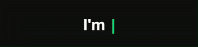

## Hi there 👋

🛠️ Tech Stack

  

📌 Featured Project
🌐 My Website

A modern website built with HTML, CSS, JavaScript, and React.

Tech: HTML • CSS • JavaScript • React

📊 GitHub Stats

   

🔗 Connect With Me

  

 <i>Code. Create. Learn. Repeat.</i> 

<!--
**Andi510/Andi510** is a ✨ _special_ ✨ repository because its `README.md` (this file) appears on your GitHub profile.

Here are some ideas to get you started:

- 🔭 I’m currently working on ...
- 🌱 I’m currently learning ...
- 👯 I’m looking to collaborate on ...
- 🤔 I’m looking for help with ...
- 💬 Ask me about ...
- 📫 How to reach me: ...
- 😄 Pronouns: ...
- ⚡ Fun fact: ...
-->
